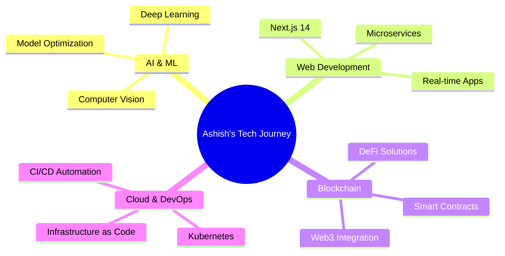

<div align="center">
  
# 👋 Hi, I'm Ashish Gupta

### Full Stack Developer | AI-ML Enthusiast | Blockchain Explorer

<p align="center">
  <em>Building intelligent, automated, and scalable systems that blend AI, Web3, and full-stack engineering</em>
</p>

[](https://linkedin.com/in/guptaashish2003)
[](https://x.com/guptaashish2003)
[](https://instagram.com/ashish.gupta_03)
[](mailto:work.ar.gutpa@gmail.com)


</div>

---

## 🚀 About Me

I'm a **Full Stack Developer** and **AI-ML enthusiast** with a strong foundation in **Computer Science fundamentals**, **Data Structures & Algorithms**, and **scalable software design**.

🎓 Currently pursuing my degree while working on innovative projects that combine **AI automation**, **blockchain technology**, and **modern web development**.

💼 **Professional Experience:**
- 🏢 **2 Internships with IBM** – Developed end-to-end web applications and cloud-based deployments
- 🚀 **Stealth Startup Internship** – Built AI-driven automation systems

### 🎯 What I Do

```javascript
const ashish = {
    code: ["JavaScript", "TypeScript", "Python", "Java", "Solidity"],
    specialization: ["Full Stack Development", "Machine Learning", "Blockchain"],
    architecture: ["Microservices", "REST APIs", "Serverless", "Progressive Web Apps"],
    currentFocus: ["AI Automation", "Web3 Technologies", "Quantitative Trading"],
    funFact: "I turn coffee into code and ideas into reality ☕️"
};
```

---

## 🛠️ Tech Arsenal

<details open>
<summary><b>💻 Languages & Core Skills</b></summary>
<br>


**Core Strengths:** Data Structures & Algorithms • Object-Oriented Programming • System Design • Database Management

</details>

<details open>
<summary><b>🤖 AI & Machine Learning</b></summary>
<br>


**Focus Areas:** Computer Vision • Deep Learning • Natural Language Processing • Model Deployment • Quantitative Analysis

</details>

<details open>
<summary><b>🌐 Web Development</b></summary>
<br>

**Frontend:**


**Backend:**


**Mobile:**


</details>

<details open>
<summary><b>☁️ DevOps & Cloud</b></summary>
<br>


**Expertise:** CI/CD Pipelines • Container Orchestration • Cloud Architecture • Serverless Computing • VPS Management

</details>

<details open>
<summary><b>🗄️ Databases</b></summary>
<br>


</details>

<details open>
<summary><b>⛓️ Blockchain & Web3</b></summary>
<br>


**Focus:** Smart Contracts • DeFi • Decentralized Applications • Cryptocurrency Integration

</details>

<details>
<summary><b>🧪 Testing & Quality Assurance</b></summary>
<br>


</details>

---

## 📊 GitHub Analytics

<div align="center">
  


</div>

---

## 🏆 GitHub Achievements

<div align="center">


</div>

---

## 🔝 Top Contributed Repositories

<div align="center">


</div>

---

## 💡 Featured Projects

<div align="center">

[](https://github.com/guptaashish2003/beyondbazaar)

</div>

> 🔍 **Exploring more projects?** Check out my [repositories](https://github.com/guptaashish2003?tab=repositories) for AI tools, web apps, and blockchain experiments!

---

## 📈 Contribution Graph

<div align="center">


</div>

---

## 💭 Developer Wisdom

<div align="center">


</div>

---

## 🎯 Current Focus



---

## 🤝 Let's Connect & Collaborate

<div align="center">

I'm always excited to collaborate on innovative projects, especially those involving:

**🤖 AI/ML Applications** • **🌐 Full-Stack Development** • **⛓️ Blockchain/Web3** • **📊 Quantitative Trading** • **🚀 Open Source**

### 📫 Reach Out

[](https://linkedin.com/in/guptaashish2003)
[](mailto:work.ar.gutpa@gmail.com)
[](https://x.com/guptaashish2003)

</div>

---

## ☕ Support My Work

<div align="center">

If you find my projects helpful or interesting, consider supporting me!

[](https://buymeacoffee.com/guptaashish2003)

</div>

---

<div align="center">

### 💻 "Code is poetry written in logic" 

**Thanks for visiting my profile! Let's build something amazing together** 🚀


</div>
